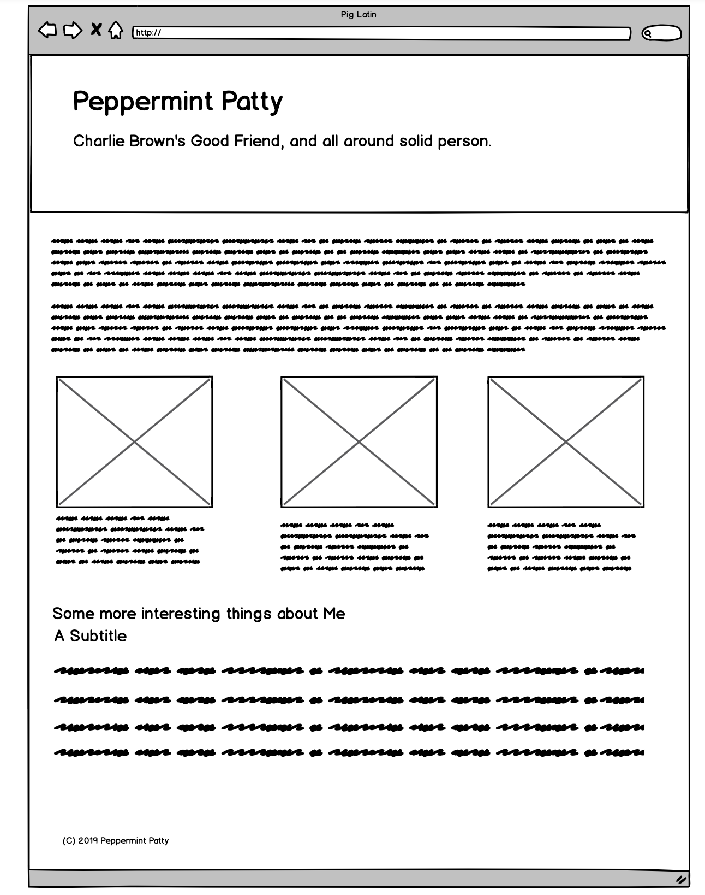

# Build Your First Webpage

#### Webpages typically have
* Header
* Body
* Footer

#### 3 Sections in Body
* Main Text
* Calls To Action
* Detail

#### Notes
Webpage is a stack of Rows

Each row can have multiple columns
